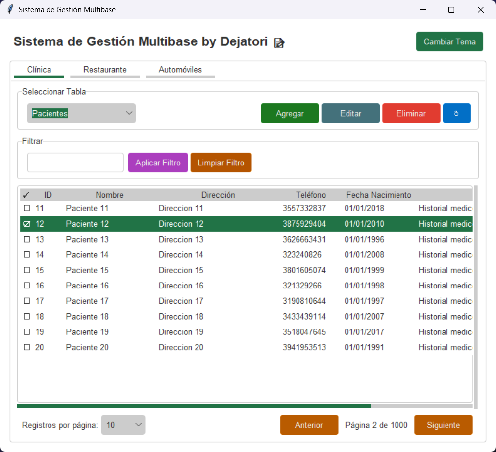

# Sistema de Gestión Multibase con Python 🐍, MySQL 📂, Flask 🌐 y Tkinter 🖥️

## Descripción del Proyecto 📝

El Sistema de Gestión Multibase es una aplicación diseñada para gestionar múltiples bases de datos de diferentes dominios, como clínicas, restaurantes y venta de automóviles.

La aplicación permite realizar operaciones CRUD (Crear, Leer, Actualizar, Eliminar) en cada una de las bases de datos, proporcionando una interfaz gráfica de usuario (GUI) intuitiva y fácil de usar.


## Resultado 📸


## Estructura del Proyecto 📂

El proyecto está organizado en los siguientes directorios:

- `models/`: Contiene los modelos de datos definidos utilizando SQLAlchemy.
- `repositories/`: Contiene los repositorios que manejan la lógica de acceso a datos.
- `routes/`: Contiene las rutas de la API Flask para cada dominio.
- `services/`: Contiene los servicios que encapsulan la lógica de negocio.
- `widgets/`: Contiene los widgets personalizados utilizados en la GUI.

## Tecnologías Utilizadas 🛠️

- **Python**: Lenguaje de programación principal.
- **Flask**: Framework web utilizado para crear la API REST.
- **SQLAlchemy**: ORM utilizado para interactuar con las bases de datos.
- **Tkinter**: Biblioteca utilizada para crear la GUI.
- **tkcalendar**: Biblioteca utilizada para los widgets de selección de fecha en la GUI.
- **requests**: Biblioteca utilizada para realizar peticiones HTTP.

## Buenas Prácticas Implementadas 🚀 

- **Modularidad**: El proyecto está dividido en módulos claros y separados, facilitando el mantenimiento y la escalabilidad.
- **Uso de ORM**: SQLAlchemy se utiliza para interactuar con las bases de datos, lo que permite una abstracción de la capa de datos y facilita la migración entre diferentes sistemas de gestión de bases de datos.
- **Inyección de Dependencias**: Los servicios y repositorios se inyectan en las rutas, promoviendo la separación de responsabilidades y facilitando las pruebas unitarias.
- **Validación de Datos**: Se implementan validaciones en los modelos para asegurar la integridad de los datos.
- **Estilo y Temas**: La GUI utiliza temas personalizados ([Forest theme](https://github.com/rdbende/Forest-ttk-theme) - Con nuevos estilos que he agregado) para una mejor experiencia de usuario.
- **Paginación**: Se implementa la paginación en las vistas de datos para mejorar el rendimiento y la usabilidad.
- **Filtros y Búsquedas**: Se permite filtrar y buscar datos en las tablas, mejorando la funcionalidad de la aplicación.

## Instalación y Configuración 🔧

1. **Clonar el repositorio**:
    ```bash
    git clone https://github.com/Dejatori/sistema-gestion-multibase.git
    cd sistema-gestion-multibase
    ```

2. **Crear un entorno virtual**:
    ```bash
    python -m venv venv
    source venv/bin/activate  # En Windows: venv\Scripts\activate
    ```

3. **Instalar las dependencias**:
    ```bash
    pip install -r requirements.txt
    ```

4. **Configurar la conexión a la base de datos (MySQL)**:
    - Asegúrese de tener las bases de datos configuradas y accesibles.
    - Actualice las configuraciones de conexión creando un archivo `.env` en la raíz del proyecto:
    ```env
        DB_USERNAME=Tu_usuario
        DB_PASSWORD=Tu_contraseña
        DB_HOST=Tu_host
        DB_PORT=Tu_puerto
    ```

5. **Crear las bases de datos y tablas**:
    - Ejecuta el archivo `modelos_relacionales.sql` para crear las bases de datos, las tablas y datos de prueba.
    ```bash
    mysql -u Tu_usuario -p < modelos_relacionales.sql
    ```

6. **Ejecutar la aplicación**:
    ```bash
    flask run
    ```

## Uso de la Aplicación 🚀

1. **Iniciar la GUI**:
    ```bash
    python gui.py
    ```

2. **Navegar entre las pestañas** para acceder a las diferentes bases de datos (clínica, restaurante, automóviles).

3. **Realizar operaciones CRUD** utilizando los botones y formularios proporcionados en la GUI.

4. **Aplicar filtros y paginación** para gestionar y visualizar los datos de manera eficiente.

## Licencia 📄

Este proyecto está licenciado bajo la Licencia GNU General Public License (GPL). Consulte el archivo `LICENSE` para obtener más detalles sobre los términos de la licencia.